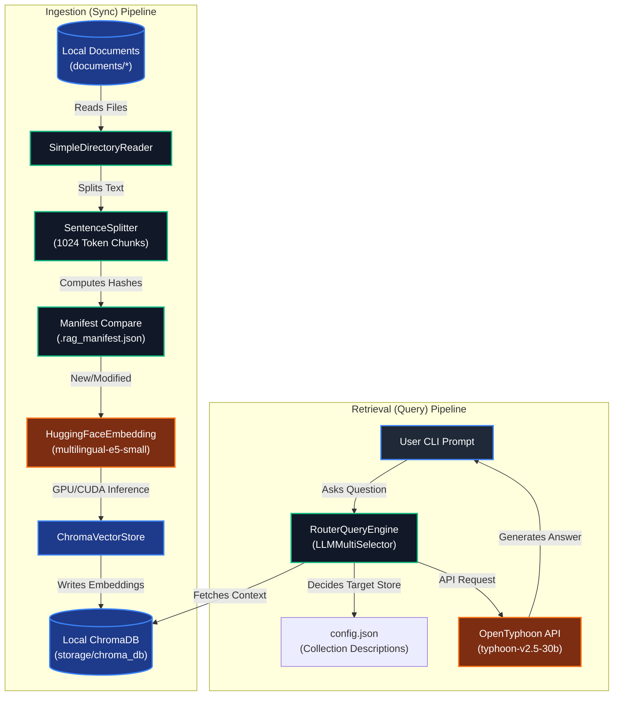

# Antigravity Agentic RAG CLI

An Agentic Retrieval-Augmented Generation (RAG) Command Line Interface (CLI) designed to serve as an intelligent chatbot that answers questions based on internal documents. By referencing company handbooks, grading guidelines, student handbooks, and policy files, it ensures compliance and helps users avoid breaking internal rules or policies.

---

## 🎯 Objective

When employees, students, or team members have questions about company rules, course syllabus structures, or grading parameters, making assumptions can lead to critical violations. This project provides a conversational AI chatbot that references verified internal documents before answering.

By feeding internal resources (e.g., guidelines, developer handbooks, and company policy guides) into a local vector database, the chatbot acts as a compliance assistant, ensuring every output is grounded in official, approved reference materials.

---

## 🗺️ Component & Directory Mapping

### 1. Command-Line Entry Point
* **File:** [main.py](file:///C:/Users/USER/Desktop/VScode/rag-agent/main.py)
* **Purpose:** Built using Typer, it acts as the user CLI interface. It supports three major commands:
  - `sync`: Triggers document scanning and incremental vector database updates.
  - `start`: Starts an interactive QA prompt session with the RAG agent router.
  - `remove [name]`: Deletes a mapped collection, its local document folder, and database entries.

### 2. Synchronization Manager
* **File:** [sync_manager.py](file:///C:/Users/USER/Desktop/VScode/rag-agent/sync_manager.py)
* **Purpose:** Handles the RAG database ingestion pipeline. It scans document folders, tracks changes/deletions incrementally using file hash comparisons (`.rag_manifest.json`), parses documents (PDF, TXT, MD), and encodes text chunks into vector embeddings via local models.

### 3. Query Router Engine
* **File:** [query_engine.py](file:///C:/Users/USER/Desktop/VScode/rag-agent/query_engine.py)
* **Purpose:** Sets up the agentic routing query engine. It connects to ChromaDB, initializes OpenTyphoon LLM, and builds a `RouterQueryEngine` with `LLMMultiSelector` to automatically route incoming questions to the most relevant document collections.

### 4. Dynamic Mapping Configuration
* **File:** [config.json](file:///C:/Users/USER/Desktop/VScode/rag-agent/config.json)
* **Purpose:** Configures collection directories, database collection names, and semantic descriptions. The router LLM uses these descriptions to dynamically select which document store(s) to query.

---

## 🏗️ System Architecture

The following flow represents the indexing (sync) pipeline and the query routing (start) pipeline:



---

## 🚀 Getting Started & Installation

### Prerequisites
- Python >= 3.9 (Python 3.12 recommended)
- An active **OpenTyphoon API Key**
- NVIDIA Graphics Card with WDDM drivers (Optional, recommended for GPU acceleration)

### Installation Steps

1. **Clone the repository:**
   ```bash
   git clone https://github.com/PhoengZ/rag-agent-help-studying.git
   cd rag-agent
   ```

2. **Set up Virtual Environment:**
   ```powershell
   python -m venv .venv
   .venv\Scripts\Activate.ps1
   ```

3. **Install Dependencies:**
   ```powershell
   pip install --upgrade pip
   pip install -e .
   ```

4. **Install GPU-Accelerated PyTorch (Optional but highly recommended):**
   To utilize your GPU and accelerate the PDF indexing process (by 10x-50x), install the CUDA 12.4 version of PyTorch:
   ```powershell
   pip install torch --index-url https://download.pytorch.org/whl/cu124 --force-reinstall
   ```

5. **Configure Environment Variables:**
   Create a `.env` file in the root directory and specify your OpenTyphoon credentials:
   ```env
   TYPHOON_API_KEY=your_typhoon_api_key_here
   CHROMA_DB_PATH=./storage/chroma_db
   DOCUMENTS_DIR=./documents
   ```

6. **Initialize / Index Documents:**
   Place your PDFs/documents inside the mapped directories (configured in `config.json` e.g., `./documents/DSDE`), then run:
   ```powershell
   python main.py sync
   ```

7. **Start Chatting:**
   ```powershell
   python main.py start
   ```

---

## ⚙️ Environmental Configuration (.env)

The application requires the following environment variables. Set them in a `.env` file in the project root:

```env
# ==========================================
# OpenTyphoon LLM Configurations
# ==========================================
# [Required] Your personal OpenTyphoon API token (compatible with OpenAI Like Client)
TYPHOON_API_KEY=sk-your-typhoon-api-key

# ==========================================
# Local Storage Configurations
# ==========================================
# [Optional] Relative or absolute path to persistent database files
CHROMA_DB_PATH=./storage/chroma_db

# [Optional] Root directory where your source folders exist
DOCUMENTS_DIR=./documents
```
